<p align="center">
  
</p>

<h1 align="center">전세보감</h1>

### 전세 사기를 예방하는 7단계 가이드 플랫폼

**👉 배포: [전세보감](https://lion5-bogam.site)**

> 복잡하고 어려운 전세 계약 과정에서 누구나 사기 피해 없이 안전하게 계약할 수 있도록,
> 공공 데이터 기반의 위험도 분석과 단계별 가이드를 한 곳에서 제공합니다.

<br/>

## 🧭 프로젝트 소개

**전세보감**은 전세 계약 전 과정을 7단계로 나눠 안내하는 **전세 사기 예방 서비스**입니다.

- 📖 **7단계 가이드** — 깡통주택 판별부터 보증금 반환 요청까지, 단계별로 해야 할 일을 안내
- 🔍 **공공 데이터 분석** — 등기부등본·납세증명서·실거래가·전세보증보험 데이터를 자동 조회·분석
- 📍 **주소별 개별 관리** — 관심 주소를 여러 개 등록하고 주소마다 별도 데이터로 관리
- 📚 **책 컨셉 UI** — Three.js와 PageFlip 라이브러리로 구현한 3D 플립북 인터페이스

<br/>

## ✨ 주요 기능

### 1. 온보딩 & 인증


- 서비스 소개 온보딩 화면
- 일반 아이디/비밀번호 로그인 + **카카오 SSO 로그인** 지원
- JWT 기반 세션 관리 (next-auth)

### 2. 메인 대시보드 — 주소 기반 개별 서비스

| 메인 페이지 | 대시보드 |
|---|---|
| 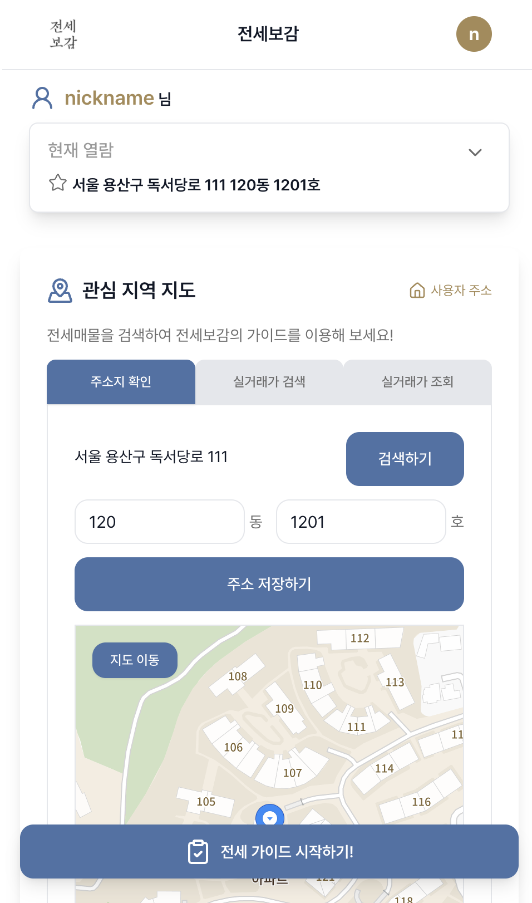 | 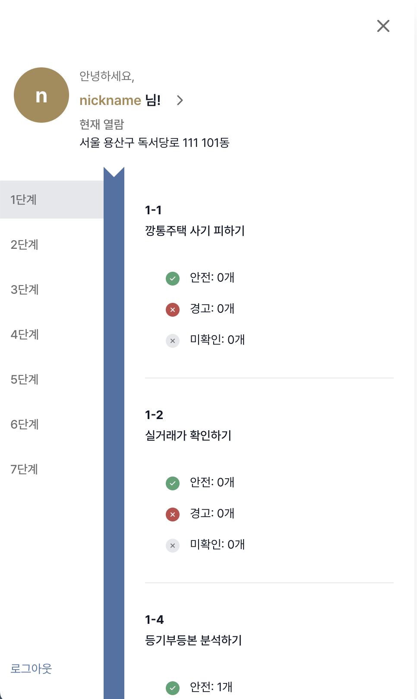 |

- 관심 주소를 여러 개 등록하고 주소별로 전세 안전도 데이터를 독립적으로 관리
- 카카오 지도 연동 — 등록된 주소 마커 표시 및 GPS 위치 확인
- 실거래가·시세 차트, 7단계 진행 현황을 한눈에 확인

### 3. 7단계 전세 안전 가이드 — 3D 플립북 UI

| 대단계 목록 | 단계별 플립북 | 세부 내용 |
|---|---|---|
| 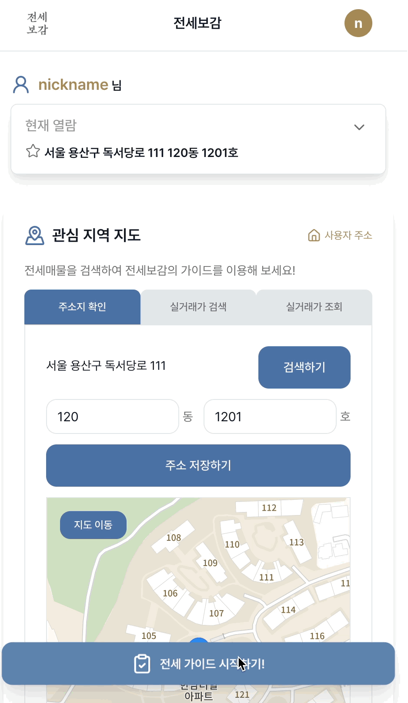 | 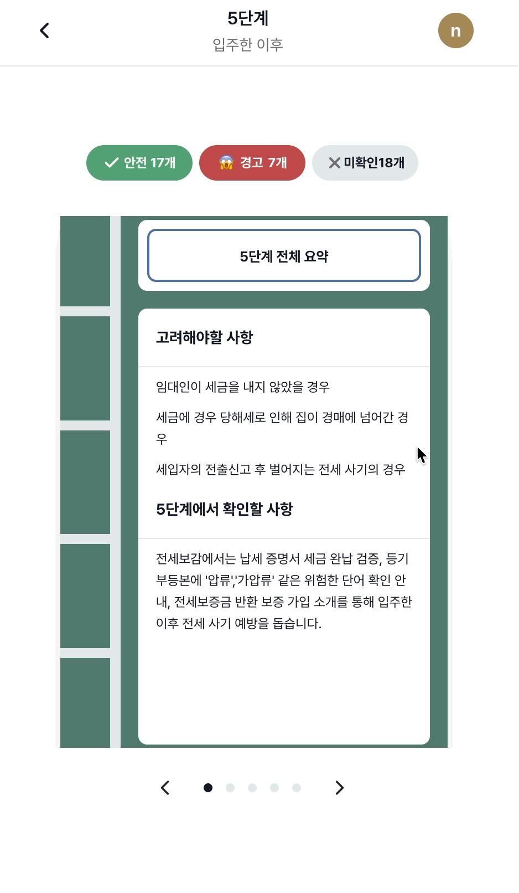 | 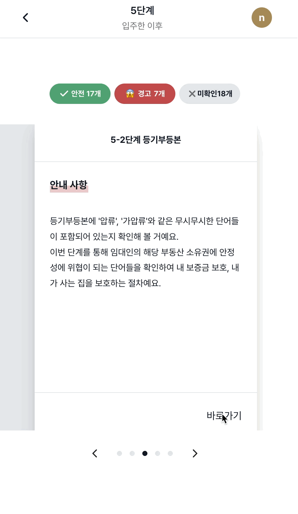 |

| 단계 | 주제 | 주요 내용 |
|---|---|---|
| 1단계 | 깡통주택 판별 | 실거래가·등기부등본·납세증명서 분석, 전세반환보증보험 가입 조건 확인 |
| 2단계 | 임대인 확인 | 가짜 임대인 자가진단, 등기부등본 상세 분석, 확정일자 부여현황 |
| 3단계 | 공인중개사 검증 | 자격증 유무 조회, 최우선변제금액 안내, 공제증서 확인 |
| 4단계 | 계약 체결 | 계약서 특약조항 안내, 전입신고·확정일자, 전세권설정 등기 안내 |
| 5단계 | 입주 후 관리 | 납세증명서·등기부등본 재확인, 전세보증금반환보증 가입, 전출신고 주의사항 |
| 6단계 | 보증금 반환 요청 | 내용증명 발송, 임차권등기명령 신청, 지급명령 신청 방법 |
| 7단계 | 추가 사기 예방 | 명의도용 대출 사기, 브로커 전세보증 사기 유형 안내 |

### 4. 공공 데이터 기반 위험도 분석

| 등기부등본 입력 | 등기부등본 결과 |
|---|---|
| 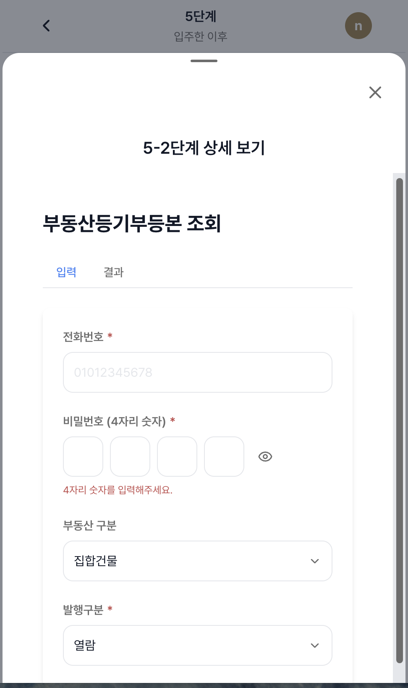 | 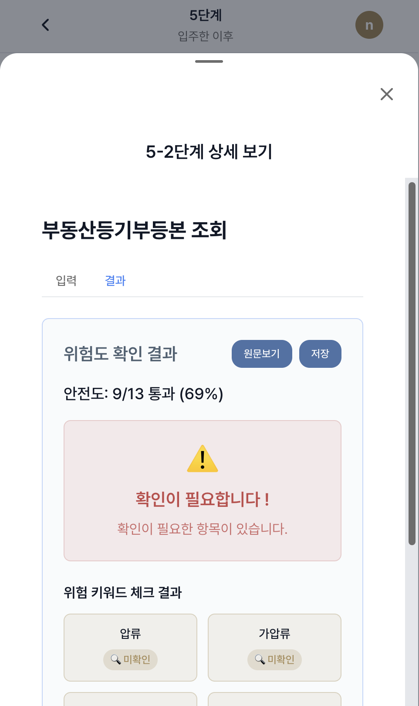 |

| 납세증명서 입력 | 납세증명서 결과 |
|---|---|
| 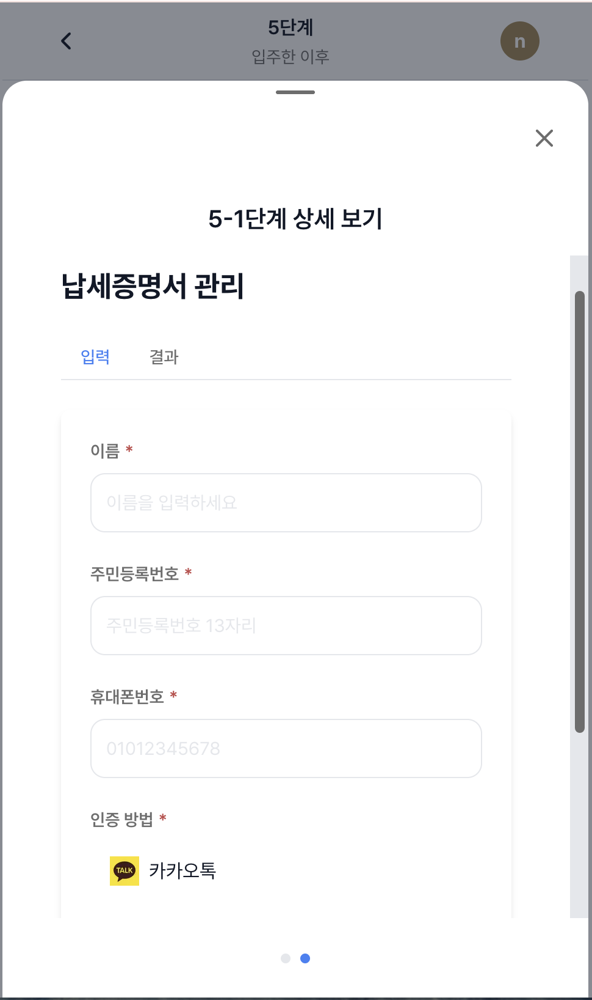 | 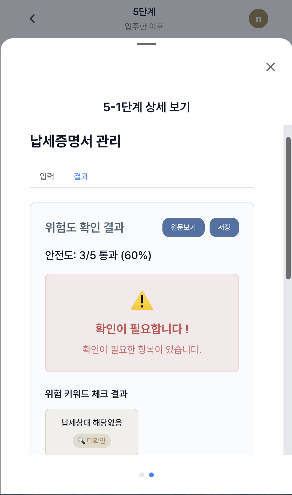 |

| 중개사 입력 | 중개사 결과 |
|---|---|
| 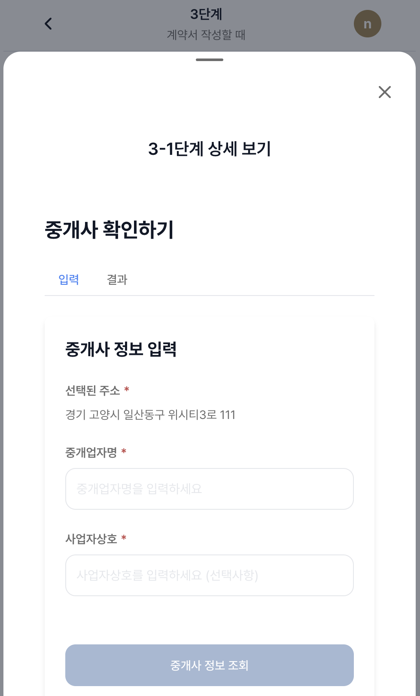 | 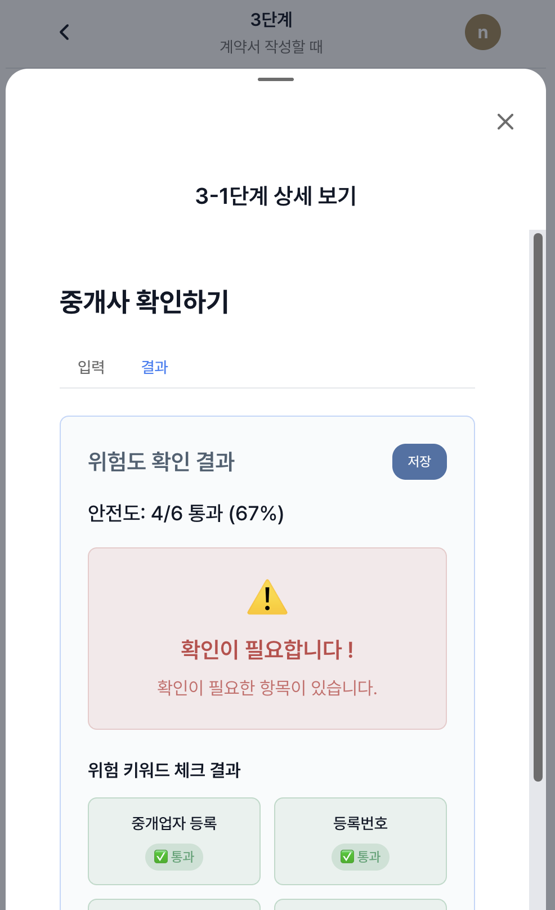 |

- CODEF API로 등기부등본·납세증명서 자동 발급
- 브이월드 API로 공인중개사 자격 조회
- 발급 데이터는 DB에 저장해 중복 발급 방지
- 원시 데이터가 아닌 **위험 항목만 필터링**해서 사용자에게 표시

### 5. 실거래가 조회 및 시세 분석

| 실거래가 입력 | 조회 모달 | 데이터 시각화 |
|---|---|---|
| 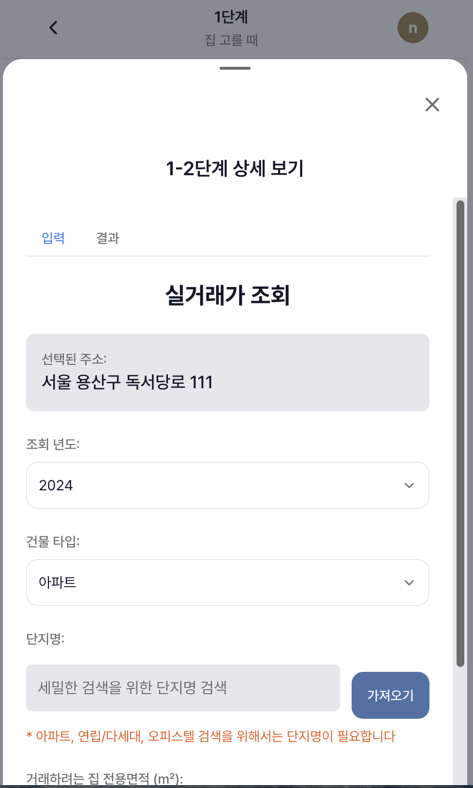 | 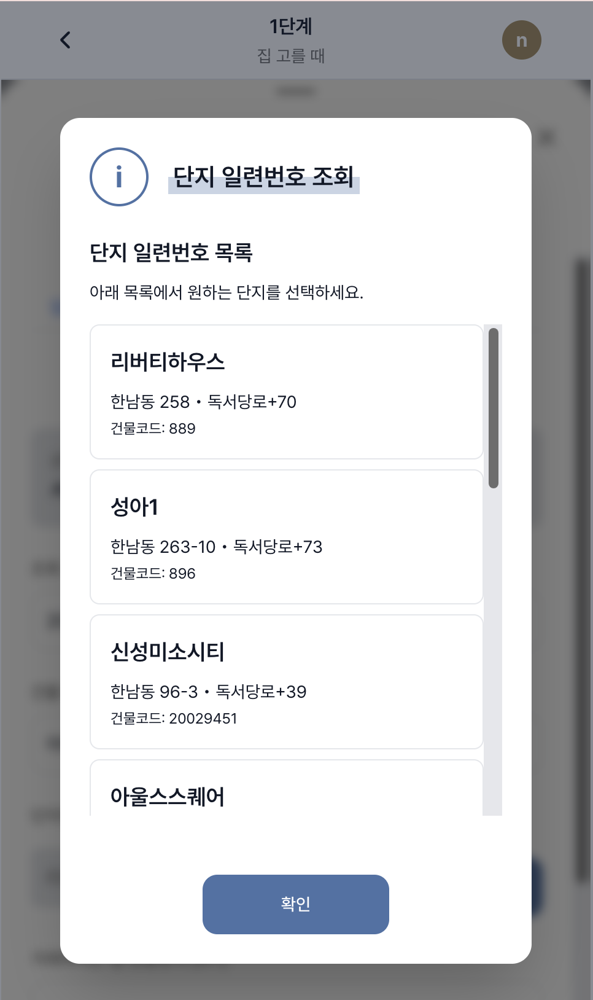 | 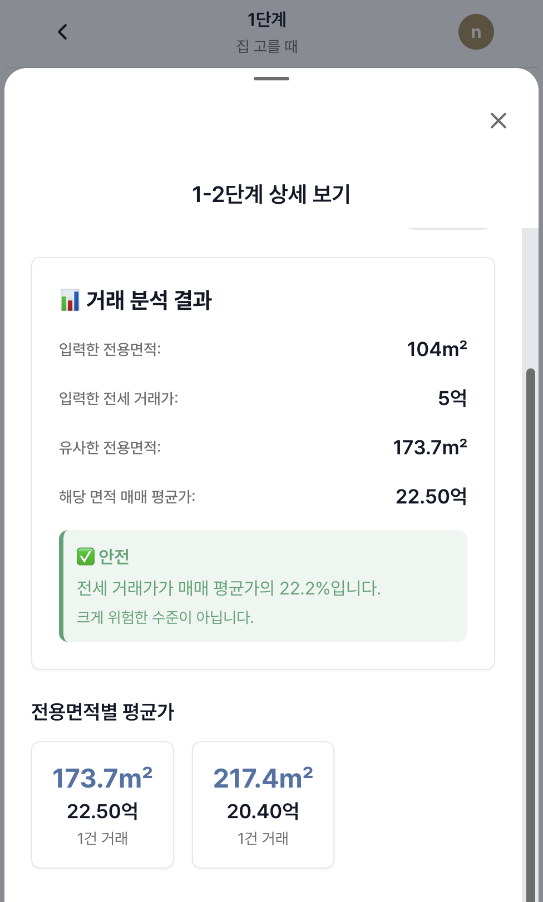 |

- 국토부 실거래가 API 연동 (아파트·오피스텔·단독주택·연립주택)
- 동별 실거래가 차트 시각화 (Chart.js)
- 계약 전세가 vs 매매 실거래가 평균 비교로 깡통주택 위험도 판단

### 6. 전세보증금 반환 보증금 계산

| 계산 입력 | 결과 |
|---|---|
| 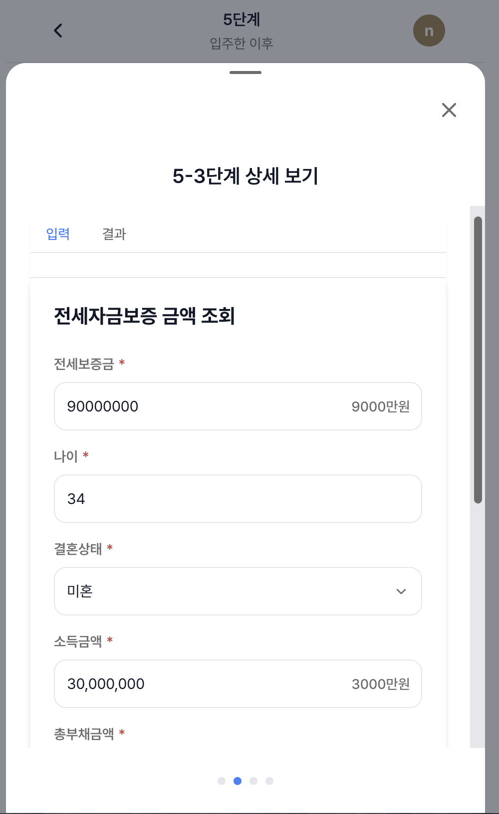 | 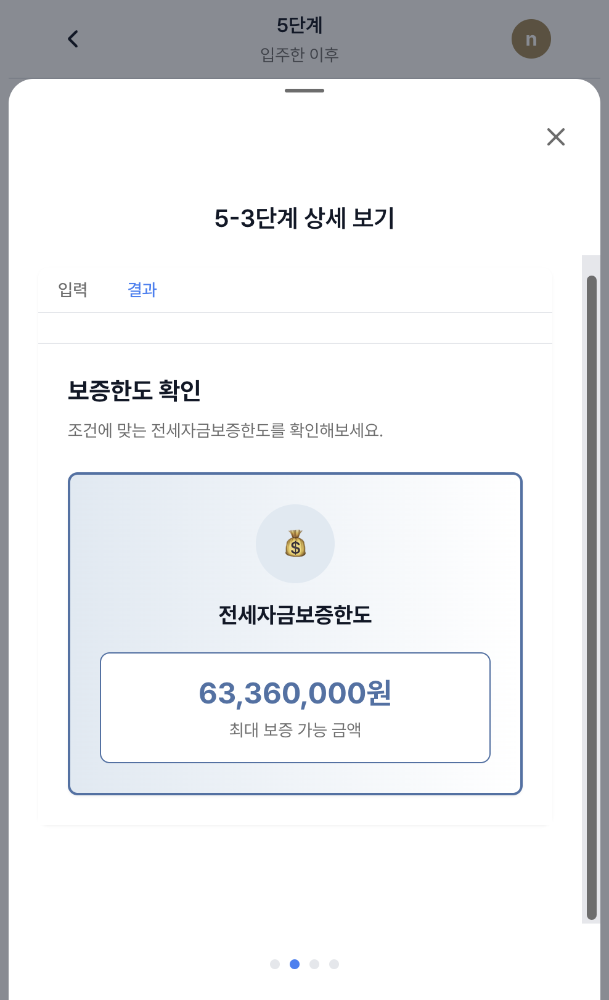 |

- HUG 전세보증보험 API 연동
- 보증금 반환 가능 금액 자동 계산 및 시각화

<br/>

## 🛠️ 기술 스택

| 분류 | 기술 |
|---|---|
| **프레임워크** | Next.js 15 (App Router), React 19, TypeScript |
| **데이터베이스** | PostgreSQL, Prisma 6 |
| **인증** | next-auth v4 (Credentials + Kakao SSO), JWT |
| **상태 관리** | Zustand v5, TanStack React Query v5 |
| **UI / 스타일** | Tailwind CSS, Lucide React |
| **3D / 애니메이션** | Three.js, react-pageflip, GSAP |
| **차트** | Chart.js, react-chartjs-2 |
| **폼 유효성 검사** | react-hook-form, Zod |
| **외부 API** | CODEF, 국토부 실거래가, 브이월드, 카카오맵, HUG |
| **배포** | Vercel |

<br/>

## 🏗️ 아키텍처

**DDD(Domain-Driven Design) 기반 클린 아키텍처**를 백엔드 레이어에 적용했습니다.

```
┌─────────────────────────────────────────────┐
│              Presentation Layer             │
│        (Next.js App Router — CSR)           │
└──────────────────────┬──────────────────────┘
                       │ fetch
┌──────────────────────▼──────────────────────┐
│            Next.js API Routes               │
│         (app/api — Backend Only)            │
└──────────────────────┬──────────────────────┘
                       │
┌──────────────────────▼──────────────────────┐
│           Application Layer                 │
│        UseCases / DTOs                      │
│      (backend/applications)                 │
└──────────────────────┬──────────────────────┘
                       │
┌──────────────────────▼──────────────────────┐
│              Domain Layer                   │
│   Entities / Repository Interfaces          │
│         (backend/domain)                    │
└──────────────────────┬──────────────────────┘
                       │
┌──────────────────────▼──────────────────────┐
│           Infrastructure Layer              │
│  Prisma Repositories / External API Clients │
│       (backend/infrastructure)              │
└─────────────────────────────────────────────┘
```

<br/>

## 📂 프로젝트 구조

```
📦 root
├─ app/                             # Next.js App Router
│  ├─ api/                          # Backend API Routes (서버 전용)
│  │  ├─ auth/                      # 인증 (next-auth)
│  │  ├─ users/                     # 회원 관리 (signup, kakao-update-info 등)
│  │  ├─ user-address/              # 주소 관리
│  │  ├─ real-estate/               # 등기부등본 조회
│  │  ├─ tax-cert/                  # 납세증명서 조회
│  │  ├─ brokers/                   # 공인중개사 조회
│  │  ├─ transactions/              # 실거래가 (아파트·오피스텔·단독주택 등)
│  │  ├─ sises/                     # 시세 조회
│  │  ├─ jeonse-guarantee/          # 전세보증보험
│  │  ├─ places/                    # 카카오 지도 (좌표변환, 장소검색)
│  │  ├─ step-results/              # 단계별 진행 결과 저장
│  │  └─ copies/                    # 발급 서류 사본 관리
│  │
│  └─ (anon)/                       # 페이지 라우트
│     ├─ main/                      # 메인 대시보드
│     ├─ steps/                     # 7단계 가이드 (3D 플립북)
│     │  └─ [step-number]/          # 단계별 FlipBook 페이지
│     ├─ real-estate-data/          # 등기부등본 데이터 조회
│     ├─ signin/ & signup/          # 인증 페이지 (카카오 SSO 포함)
│     └─ mypage/                    # 마이페이지
│
├─ backend/                         # 클린 아키텍처 백엔드 레이어
│  ├─ applications/                 # UseCase, DTO
│  ├─ domain/                       # Entity, Repository Interface
│  └─ infrastructure/               # Prisma Repository 구현체, 외부 API 클라이언트
│
├─ hooks/                           # 커스텀 훅 (TanStack Query 기반)
├─ libs/
│  ├─ api_front/                    # 프론트 API 클라이언트 함수
│  ├─ stores/                       # Zustand 전역 상태
│  └─ codef/                        # CODEF API 연동 모듈
├─ prisma/                          # DB 스키마 (Prisma)
└─ types/                           # 공통 타입 정의
```

<br/>

## 💡 시작 가이드

<details>
<summary><strong>보기</strong></summary>

#### 실행 환경

- Node.js 20+
- `.env` 파일에 아래 항목 필요

```env
CODEF_DEMO_CLIENT_ID=
CODEF_DEMO_CLIENT_SECRET=
CODEF_PUBLIC_KEY=
RTMSDATA_TRANSACTION_PRICE_KEY=
VWORLD_BROKER_KEY=
KAKAO_CLIENT_ID=
KAKAO_CLIENT_SECRET=
KAKAO_REDIRECT_URI=
KAKAO_REST_API_KEY=
NAVER_CLIENT_ID=
NAVER_CLIENT_SECRET=
DATABASE_URL=
NEXTAUTH_SECRET=
NEXTAUTH_URL=
ENCRYPTION_KEY=
NEXT_PUBLIC_KAKAO_MAP_API_KEY=
NEXT_PUBLIC_KAKAO_REST_API_KEY=
```

#### 프로젝트 실행

```bash
# 클론
git clone https://github.com/Jihye-kr/BoGam.git

# 의존성 설치
npm install

# DB 마이그레이션
npm run db:migrate

# 개발 서버 실행
npm run dev
```

</details>

<br/>

## 🗓 개발 기간

2025.08
