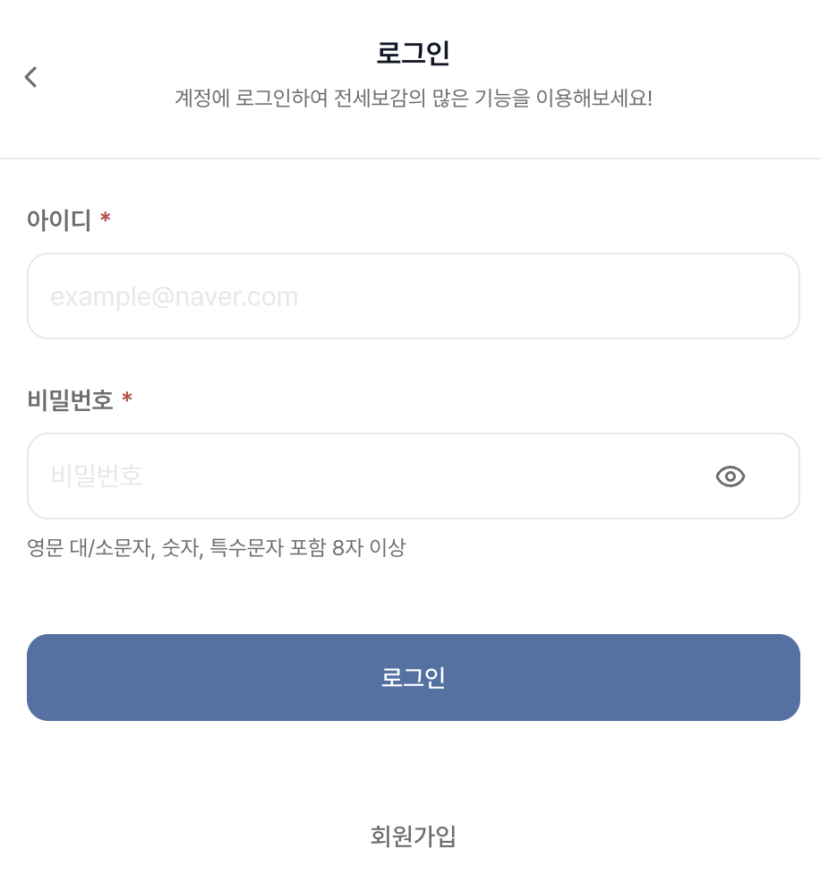
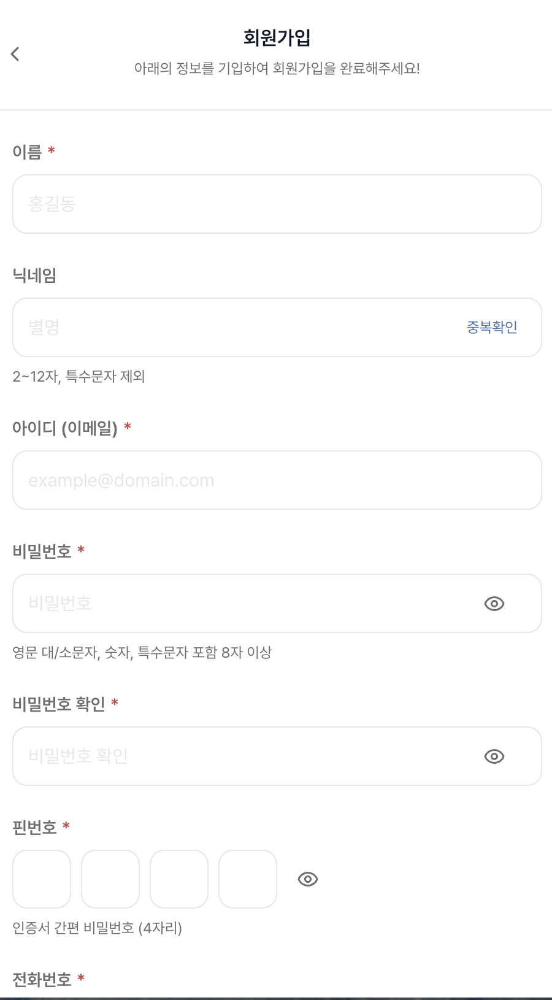
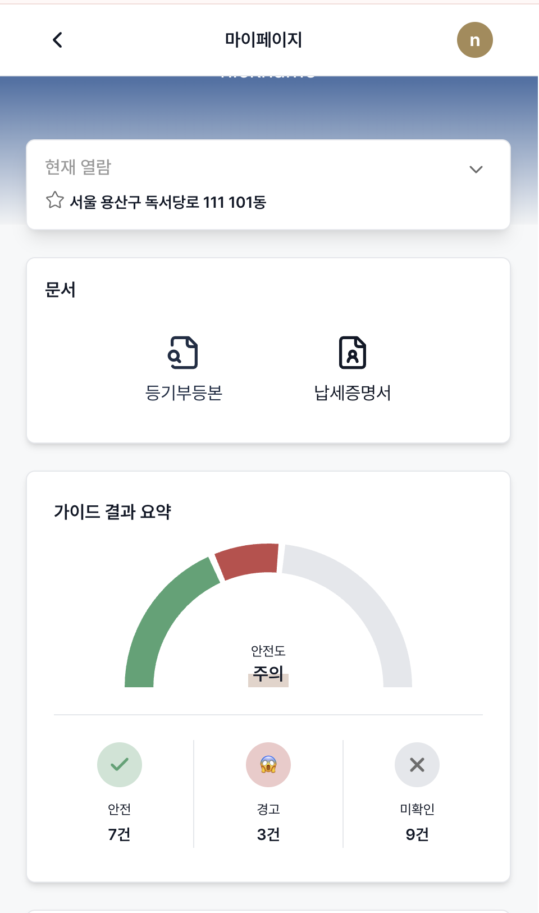
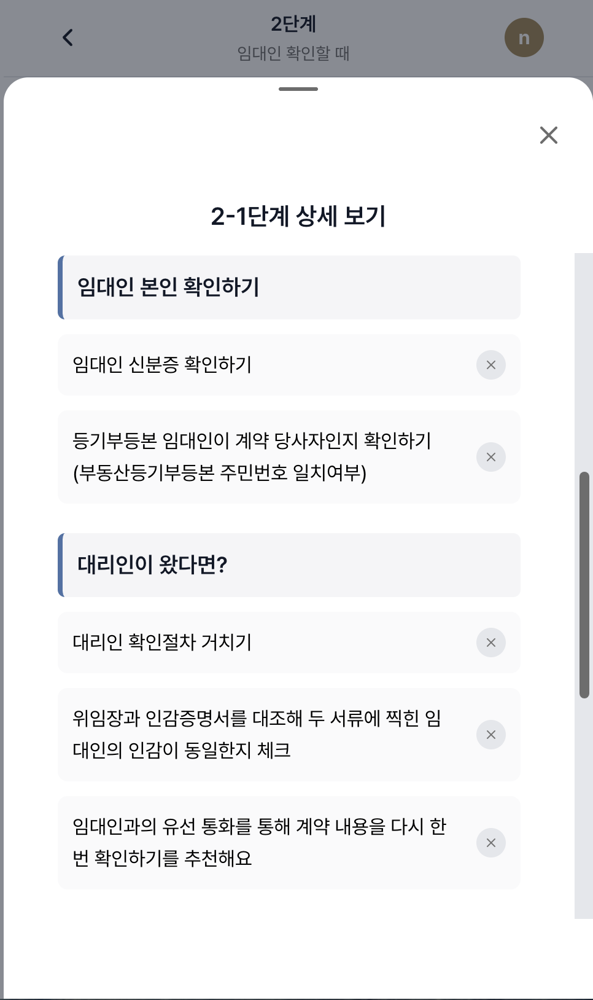

# **전세보감**

> ### 주요 서비스 : 전세 사기를 예방하는 다양한 방법을 가이드 하는 서비스<br>

### 🌱 전세사기 예방은, 전세보감! 🌳

전세 사기를 예방을 위한 3가지!

1. 필요한 정보를 "전세보감" 하나로
2. 복잡한 신청 방법도 "전세보감"
3. 어려운 단어나 복잡한 용어도 "전세보감"

<br>
<br>

### 🙋🙋‍♂️ 함께 만드는 사람들

| [조승연](https://github.com/layout-SY)                                          | [김지혜](https://github.com/Jihye-kr)                                           | [노석준](https://github.com/aiden0413)                                         | [임채원](https://github.com/icw0201)                                            |
| ------------------------------------------------------------------------------- | ------------------------------------------------------------------------------- | ------------------------------------------------------------------------------ | ------------------------------------------------------------------------------- |
|  |  |  |  |
| <p align="center">FE / BE</p>                                                   | <p align="center">FE</p>                                                        | <p align="center">FE / BE</p>                                                  | <p align="center">FE / BE</p>                                                   |

<br>

### 🗓 개발 기간

✨ 2025.08 - 2025.08

<br>

### 🍏 배포 주소

#### [전세보감]- https://lion5-bogam.site

<br>

### 🗒 프로젝트 자료

#### [전세보감 Note](https://www.notion.so/2-264cb05a2710807d8734e8edd4875d30)

<br>

### 💡 시작 가이드

<details>
<summary><strong>보기</strong></summary>
<div markdown="1">

#### 📍 실행 환경

- Node.js 20.18.1
- `.env 파일`에 아래의 항목들이 있어야 합니다.

  - `CODEF_DEMO_CLIENT_ID` : 외부 API(CODEF API) client id
  - `CODEF_DEMO_CLIENT_SECRET` : 외부 API(CODEF API) client secret
  - `VWORLD_BROKER_KEY` : 외부 API(브이월드 API) 브이월드 key
  - `KAKAO_CLIENT_ID` : 외부 API(카카오 API) 카카오 client id
  - `KAKAO_REDIRECT_URI` : 외부 API(카카오 API) redirect URL 주소
  - `KAKAO_REST_API_KEY` : 외부 API(카카오 지도 API) 카카오 지도 사용 key
  - `DATABASE_URL` : 원격 서버 DB 연결 URL
  - `NEXTAUTH_SECRET` : Next auth secret key
  - `NEXTAUTH_URL` : Next auth URL
  - `NEXT_PUBLIC_KAKAO_MAP_API_KEY` : 외부 API(카카오 API) 카카오 지도 JavaScript API 키
  - `NEXT_PUBLIC_KAKAO_REST_API_KEY` : 외부 API(카카오 API) 카카오 지도 JavaScript REST API 키

#### 📍 프로젝트 실행

- 프로젝트 클론

```bash
$ git clone https://github.com/FRONT-END-BOOTCAMP-PLUS-5/BoGam.git
```

- 의존성 설치

```bash
$ npm install
```

- 실행

```bash
$ npm run dev
```

</div>
</details>

<br>

### ⌨️ 기술 스택

#### 백엔드

   

#### 프론트엔드


#### CI/CD

   

#### 협업 도구


<br>

### 🎯 컨벤션

<details>
<summary><strong>개발 컨벤션 보기</strong></summary>
<div markdown="1">

#### 1. 함수 작성 규칙

```typescript
// 기본 함수 형태
export default function ComponentName() {
  return (
    // JSX
  )
}
```

#### 2. 페이지 이름 규칙

- **Prefix**: Next.js App Router 규칙 준수
- **URL**: 케밥 케이스 (kebab-case)
- **컴포넌트명**: 대문자 시작, 카멜 케이스

#### 3. 컴포넌트 관리

**기본 컴포넌트**

```typescript
const Component = () => {
  return (
    // JSX
  )
}

export default Component;
```

**Props 타입 정의**

```typescript
// Component.tsx
const Component = ({}: ComponentProps) => {
  // 컴포넌트 로직
};

// types/ComponentProps.ts
export type ComponentProps = {
  // Props 타입 정의
};
```

#### 4. CSS 스타일링

- **Tailwind CSS** 사용
- **디자인 레퍼런스**: 토스 앱
- **CSS 변수**: Camel case (headerBox)

#### 5. 패키지 매니저

- **npm** 사용

#### 6. 코드 스타일

- **ESLint & Prettier**
- 자동화된 ESLint (승연님이 추가 예정)
- Prettier 포맷팅

**API 폴더명 규칙**

- `/api/kebab-text` 형식

**식별자 규칙**

| 항목             | 규칙             | 예시                              |
| ---------------- | ---------------- | --------------------------------- |
| 변수명           | camelCase        | userName, isLoggedIn              |
| 함수명           | camelCase        | getUserInfo(), handleSubmit()     |
| 클래스명         | PascalCase       | UserService, AuthController       |
| React 컴포넌트명 | PascalCase       | UserCard.tsx, TaxCertForm.tsx     |
| 상수             | UPPER_SNAKE_CASE | DEFAULT_TIMEOUT, API_URL          |
| 훅 이름          | use + camelCase  | useUserStore(), useTaxCertQuery() |

**파일명 규칙**

| 파일 종류      | 규칙           | 예시                              |
| -------------- | -------------- | --------------------------------- |
| 일반 파일      | kebab-case.ts  | tax-cert-form.ts, user-service.ts |
| React 컴포넌트 | PascalCase.tsx | TaxCertForm.tsx, UserProfile.tsx  |
| 폴더명         | kebab-case/    | components/, api/, tax-cert/      |
| 훅 폴더        | hooks/useX.ts  | hooks/useTaxCert.ts               |
| 유틸 함수      | utils/xxx.ts   | utils/formatDate.ts               |

**변수명 규칙**

- **Boolean 타입**: is, has, can 등으로 시작
  - `isLoggedIn`, `hasPermission`, `canSubmit`
- **함수**: '동사 + 명사' 형태
  - 좋은 예: `fetchUserData()`, `calculateTotalPrice()`
  - 나쁜 예: `data()`, `price()`
- **코드 스타일**: string은 작은 따옴표(')로 감싸기
- **약어 금지**: 명확성이 떨어지면 전체 단어 사용
  - 좋은 예: `userProfile`
  - 나쁜 예: `usrProf`

#### 7. 전역 상태관리

- **Zustand** 사용

#### 8. Git 관리

**브랜치 전략**

```
main
└── dev
    ├── feat/#1
    ├── feat/#2
    ├── feat/#78
    ├── refactor/#29
    └── fix/#2
```

**작업 플로우**

1. **Issue 작성** → 작업 전 이슈 작성
   - Summary: 작업 한줄 요약
   - Descriptions: 문제와 해결 방안 설명
2. **커밋** → 유연한 단위로 커밋
3. **PR 작성** → 매일 5시에 PR 생성
   - 리뷰어: 코드 작성 관련 2인 이상
   - Assignees: 작업자 지정
   - Approve 2명 이상 시 Merge

**PR 템플릿**

```markdown
## 🔍 개요 (Overview)

이 PR은 어떤 변경사항을 담고 있나요? 관련 이슈가 있다면 연결해주세요.
(예: Closes #이슈번호)

## ✅ 작업 사항 (Work Done)

- [ ] 작업 내역 1
- [ ] 작업 내역 2
- [ ] UI 변경이 있다면 스크린샷을 첨부해주세요.

## 📸 스크린샷 (Screenshots)

| Before | After |
| :----: | :---: |
|        |       |

## reviewers에게

- 리뷰어가 특별히 신경써서 봐야 할 부분이 있다면 알려주세요.
- 궁금한 점이나 논의가 필요한 부분도 좋습니다.
```

**커밋 메시지 양식**

한글 형식: `<type>: <subject>(한국어)`

- **글자수 제한**: 각 줄 최대 72글자 준수
- **Body**: 무엇을 왜 변경했는지 설명

예시:

```
feat: 랭킹 리스트 조회 기능 구현
주니어 랭킹 조회를 위해 getRankingLists 함수 추가
```

**커밋 타입**

| 타입     | 설명              |
| -------- | ----------------- |
| feat     | 새로운 기능 추가  |
| fix      | 버그 수정         |
| docs     | 문서 수정         |
| style    | 코드 스타일 변경  |
| design   | UI 디자인 변경    |
| test     | 테스트 코드 작성  |
| refactor | 코드 리팩토링     |
| build    | 빌드 파일 수정    |
| ci       | CI 설정 파일 수정 |
| perf     | 성능 개선         |
| chore    | 자잘한 수정       |
| rename   | 파일/폴더명 수정  |
| remove   | 파일 삭제         |

**Push 규칙**

- 집 갈 때 한 번은 push하기

**PR 전 체크리스트**

- [ ] 최신 dev 브랜치 머지: PR 보내기 전 local에서 최신 dev를 merge해서 충돌 처리
- [ ] 빌드 확인: `npm run build` 실행하여 빌드가 정상적으로 되는지 확인 후 dev에 merge

</div>
</details>

<br>

### ⭐️ 주요 기능

- 복잡한 전세 사기 예방 데이터 시각화 및 저장 기능

  - 등기부등본, 납세증명서, 중개인, 실거래가, 시세, 전세금 반환금 계산 등 다양한 전세 사기를 방지 하고, 예방하기 위한 데이터를 제공합니다.
    - 등기부등본 API 문서 링크
    - 납세증명서 API 문서 링크
    - 중개인 API 문서 링크
    - 실거래가 API 문서 링크
    - 시세 API 문서 링크
    - 공시지가 API 문서 링크
    - 전세금 반환금 계산 API 문서 링크
  - 해당 데이터들을 직접적으로 보여주는 것이 아닌 필요한 데이터만 필터링(위험도 검사) 하여 사용자에게 보여줍니다.
  - 필터링된 데이터 중 사용자가 임의로 확인 해야 하는 내용을 체크리스트를 통해 보여줍니다.
  - 데이터를 외부 API를 통해 발급 받으면 내부 DB에 저장 되어 추가 발급을 방지 합니다.

- 신청 방법 가이드 제공

  - 전세 사기를 예방 혹은 방지 하고자 신청 해야 하는 내용과 방법을 가이드 합니다.
  - 사용자가 가이드의 어디까지 진행 했는 지를 시각적으로 보여줍니다.
  - 사용자의 가이드 단계 정보를 자동으로 저장합니다.

- UI

  - Three.js와 pageFilp 라이브러리를 사용하여 "전세보감"이라는 서비스 컨셉을 살렸습니다.

- 사용자 주소에 따른 개별 서비스 제공
  - 사용자는 확인 하고자 하는 주소를 여러 개 등록 가능하며, 해당 주소 마다 별도에 데이터로 구분 됩니다.

<br>

### 📂 폴더 구조

<details>
<summary><strong>구조 보기</strong></summary>
<div markdown='1'>

```
Bogam/
├── app/                 # Next.js App Router 페이지들
│   ├── (anon)/         # 인증되지 않은 사용자 페이지들
│   │   ├── _components/ # 공통 컴포넌트들
│   │   │   └── common/ # 자주 사용되는 컴포넌트들 (버튼, 폼, 모달 등)
│   │   ├── @detail/    # 소단계계 페이지들
│   │   ├── main/       # 메인 페이지
│   │   ├── mypage/     # 마이페이지
│   │   ├── real-estate-data/ # 부동산 데이터 페이지
│   │   ├── signin/     # 로그인 페이지
│   │   ├── signup/     # 회원가입 페이지
│   │   ├── steps/      # 중단계 페이지
│   │   └── tex-cert-data/ # 세금계산서 데이터 페이지
│   └── api/            # API 라우트들
│
├── hooks/               # React Hooks
│   ├── main/           # 메인 페이지 관련 hooks
│   └── (기타 hooks)    # 공통 hooks

├── libs/                # 라이브러리 및 공통 모듈
│   ├── stores/         # 상태 관리 파일들
│   ├── api_front/      # 프론트엔드 API 클라이언트
│   ├── constants/      # 상수 정의
│   └── codef/          # 코드에프 관련 모듈

├── utils/               # 유틸리티 함수 및 모듈
│   ├── main/           # 메인 페이지 관련 유틸리티
│   ├── sise/           # 시세 관련 유틸리티
│   └── verifyPassword/ # 비밀번호 검증 유틸리티

├── hooks/               # React Hooks
│   ├── main/           # 메인 페이지 관련 hooks
│   └── (기타 hooks)    # 공통 hooks

├── types/               # TypeScript 타입 정의
│   ├── kakao-maps.d.ts
│   └── next-auth.d.ts

├── metadata/            # 메타데이터 파일들
│   ├── mainMetadata.ts
│   └── stepMetadata.ts

├── public/              # 정적 파일들 (이미지, 아이콘, 모델 등)
│   ├── images/         # 이미지 파일들
│   ├── models/         # 3D 모델 파일들
│   └── icons/          # 아이콘 파일들

├── backend/             # 백엔드 (Clean Architecture)
│   ├── applications/
│   ├── domain/
│   └── infrastructure/

├── prisma/              # 데이터베이스
│   └── schema.prisma

└── scripts/             # 빌드 스크립트
    └── (유틸리티 스크립트들)
```

</div>
</details>

<br>

### 🖥 화면 구성

| 온보딩 페이지                                                 |
| ------------------------------------------------------------- |
|  |

| 메인 페이지                                             |
| ------------------------------------------------------- |
|  |

| 대단계 페이지                                               |
| ----------------------------------------------------------- |
|  |

| 중단계 페이지                                                  |
| -------------------------------------------------------------- |
|  |

| 소단계 페이지                                                 |
| ------------------------------------------------------------- |
|  |

| 로그인 페이지                                         | 회원가입 페이지                                            |
| ----------------------------------------------------- | ---------------------------------------------------------- |
|  |  |

| 대시보드 페이지                                               | 마이 페이지                                            |
| ------------------------------------------------------------- | ------------------------------------------------------ |
|  |  |

| 등기부등본 발급 입력 부분                                       | 납세증명서 발급 입력 부분                                    | 부동산 중개업자 입력 부분                                   |
| --------------------------------------------------------------- | ------------------------------------------------------------ | ----------------------------------------------------------- |
|  |  |  |

| 등기부등본 데이터 시각화                                         | 납세 증명서 데이터 시각화                                     | 부동산 중개업자 데이터 시각화                                |
| ---------------------------------------------------------------- | ------------------------------------------------------------- | ------------------------------------------------------------ |
|  |  |  |

| 실거래가 입력 부분                                                   | 실거래가 확인 모달                                                   | 실거래가 데이터 시각화                                                |
| -------------------------------------------------------------------- | -------------------------------------------------------------------- | --------------------------------------------------------------------- |
|  |  |  |

| 신청 방법 가이드                                                   |
| ------------------------------------------------------------------ |
|  |

| 전세금 반환 보증금 계산 입력 부분                            |
| ------------------------------------------------------------ |
|  |

| 전세금 반환 보증금 계산 데이터 시각화                   |
| ------------------------------------------------------- |
|  |

<br>

<br>
